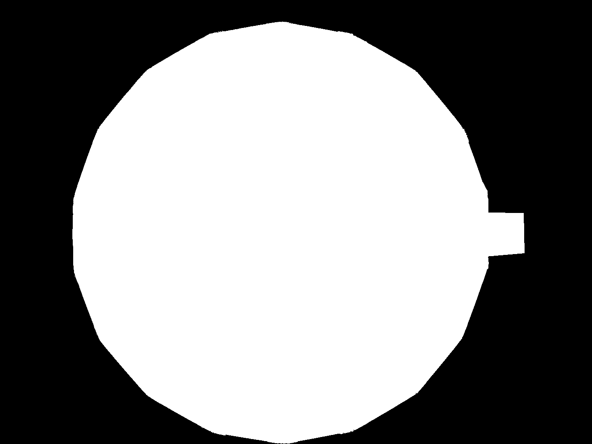

# Computer vision tracking

One of the most salient and common features of monitoring behaviour, particularly in freely moving experiments, is the position of the animal subjects. This requires online detection and tracking. In Aeon we achieve this in two different ways. Using computer vision object detection techniques, detailed [here](#computer-vision-object-detection), or using the AI pose estimation package [SLEAP](https://sleap.ai/).

## Computer vision object detection

Create a `GroupWorkflow`, add an `PositionTracking (Aeon.Acquisition)` node, externalise all properties and connect it to the `WorkflowOutput`:

## Inputting camera stream

This node accepts `Harp.Timestamped<Aeon.Acquisition.VideoDataFrame>` generated by a [camera](../../HardwareDevices/Camera/camera.md) device and detects dark objects against a light background using a standard blob tracking pipeline. 

Add a `SubscribeSubject` to your workflow, connect it to the `PositionTracking` node as an input and externalise the `Name` property. This name will be set to the `Subject` that carries the `CameraEvents` from the camera you wish to perform tracking on, for example `CameraTop`. Change the display name of the externalised `Name` property to `FrameEvents` to avoid confusion:

Briefly, the incoming image is thresholded to a binary image, then masked using a binary mask image generated by the user. This mask should include any area in which the animal could be at a given time, and must have the same width and height as the camera event images for which it is intended:

    <figure style="margin-right: 10px; text-align: center;">
        
        <figcaption>Camera Top</figcaption>
    </figure>
    <figure style="text-align: center;">
        
        <figcaption>Arena Mask</figcaption>
    </figure>

 This ensures that movement or activity outside of the arena (therefore have pixel values of zero in the manually generated mask) are eliminated and not tracked.

Contours are found and located using the `FindContours` and `BinaryRegionAnalysis` functions from openCV.NET (available in `Bonsai.Vision` package) and a custom `TakeLargestRegions (Aeon.Acquisition)` to take the *n* largest regions (defined by the property **TrackingCount** above). 

## **Properties of PositionTracking**

You should now have a `GroupWorkflow` called "Tracking" or similar. The properties of this `GroupWorkflow`, accessible when selected include the parameters for tuning the tracking workflow and the names of the input and output `Subjects`.

### ***Tracking parameters:***

| **Property Name**  | **Description**                                                                           |
|--------------------|-------------------------------------------------------------------------------------------|
| **Mask**           | The full or relative path to the mask image, in `.png` format    |
| **Threshold** | The threshold pixel value to apply in order to detect a dark blob on the light background |
| **TrackingCount** | The expected number of animals to track simultaneously |

### ***Subject names:***
Events from this node are published to a `Subject` to make it available anywhere in the workflow. Here in the properties, you define a name to give this `Subject` 

## **Subjects** 

### **Device Event Subject**:
| **Subject Name**  | **Type** | **Description**                                  |
|-------------------|----------|--------------------------------------------------|
| **TrackingEvents** | `Harp.Timestamped<Bonsai.Vision.ConnectedComponentCollection>` |The `Subject` to which tracking data will be published. This stream is also output directly by the node | 

### **Device Input Subject**

| **Subject Name**  | **Type** | **Description**                                  |
|-------------------|----------|--------------------------------------------------|
| **FrameEvents**   | `Harp.Timestamped<Aeon.Acquisition.VideoDataFrame>` | The `Subject` to subscribe to that carries frame events from a chosen camera | 

## Logging

Logging this soft device is done using a `logHarpState` node detailed in this [guide](../../Logging/LogHarpState.md). This node writes `Harp.HarpMessages` to binary files named according to the `LogName` property. `TrackingEvents` can be formatted using the custom `FormatBinaryRegions (Aeon.Acquisition)` to convert the events to `HarpMessages` and configure writing to register **200**. This is an unassigned register on all harp devices. For Project AEON, we store this tracking data along with the camera from which `FrameEvents` originated. So for `CameraTop` e.g.:

Multiple `PositionTracking` nodes can be placed and properties changed to track objects in different camera streams simultaneously, by selecting a different `FrameEvents` subject and saving to the individual camera folders.

## Alerts

TBC

---

## Region Tracking

In Project Aeon, it is often beneficial to define specific regions or areas of the arena that are of behavioural significance and record times that a subject occupied these areas. 
For example, the time that a subject spends sheltering in the [nest](../../HardwareDevices/Nest/nest.md) vs in an open area or near to a [foraging patch](../../HardwareDevices/ForagingPatch/foragingPatch.md). 
While this may be done in post-processing and analysis, at times this can also be a useful marker to trigger events during the experiment, or simply to provide a coarse readout of the general activity of the animal.  
For these functions, several utility nodes are available as part of `Aeon.Acquisition`. 

The node accepts tracking events in the format `Harp.Timestamped<Bonsai.Vision.ConnectedComponentCollection>` generated by the `PositionTracking` node above.
Subscribe to the common `Subject` carrying these events and connect it to a `RegionTracking (Aeon.Acquisition)` node. Externalise the `Regions` property and rename it to indicate the regon this node is responsible for monitoring.

### **Properties of RegionTracking**

The node simply computes and returns a `boolean` describing whether the tracking position of the animal falls within a specific region of the camera image. 

### ***General (Misc)***

| **Property Name**  | **Description**                                                                           |
|--------------------|-------------------------------------------------------------------------------------------|
| **Region**         | An array of four `OpenCV.NET.Points`. These define the corners (anticlockwise from top left) of the region of interest     |

### ***Subject names:***
Events both for input and generated from this node are published to a `Subject` to make it available anywhere in the workflow. Here in the properties, you define the name of these `Subject`s 

### **Subjects**

#### **Device Event Subject**:
| **Subject Name**  | **Type** | **Description**                                  |
|-------------------|----------|--------------------------------------------------|
| **RegionEvents** | `Harp.Timestamped<bool>` |The `Subject` to which region events will be published. This stream is also output directly by the node | 

#### **Device Input Subject**

| **Subject Name**  | **Type** | **Description**                                  |
|-------------------|----------|--------------------------------------------------|
| **FrameEvents**   | `Harp.Timestamped<Aeon.Acquisition.VideoDataFrame>` | The `Subject` to subscribe to that carries frame events from a chosen camera | 

## DistanceFromPoint

Similarly to `RegionTracking`, this node also accepts tracking events and computes the distance of the tracking animal from a set position in the camera image, given in the properties.

### **Properties of DistanceFromPoint node**

The node simply computes and returns a `double` describing the distance in pixels from a specific point.

### ***General (Misc)***

| **Property Name**  | **Description**                                                                           |
|--------------------|-------------------------------------------------------------------------------------------|
| **Region**         | An array of four `OpenCV.NET.Points`. These define the corners (anticlockwise from top left) of the region of interest     |

Unlike some other nodes, `RegionTracking` does not output to a published `Subject`, but directly outputs a `Harp.Timestamped<double>` of this distance in pixels.
This can then be used as the user wishes. In Project AEON, with a circular corridor on the outside of the circular arena, we use this to determine distance from the centre of the arena, and therefore determine whether the animal is in the open arena or in the corridor using another utility node, `InRange (Aeon.Acquisition)`

## InRange
This node is used to compute whether a tracked object is within a certain range in a single dimension. For project AEON, we utilise this to determine whether the tracked animal is within the main arena, or in the corridor running around the outside of the arena. However, this utility node can be adapted for other purposes.
Create a `GroupWorkflow` and add an `InRange` node, connected to the `WorkflowInput` and `WorkflowOutput` as shown. Externalise the relevant properties. 

The node computes and returns a `boolean` describing whether each value of a sequence falls within a specific range, and publishes the result to a `Subject`

### **Properties of InRange node**

### ***General (Misc)***

| **Property Name**  | **Description**                                             |
|--------------------|-------------------------------------------------------------|
| **Lower**          | The lower end of the range to check the input value against.|
| **Upper**          | The upper end of the range to check the input value against.|

### ***Subject names:***
Events generated by this node are published to a `Subject` to make it available anywhere in the workflow. Here in the properties, you define the name of these `Subject`s 

### **Subjects**

#### **Device Event Subject**:
| **Subject Name**  | **Type** | **Description**                                                  |
|-------------------|--------------------------|--------------------------------------------------|
| **RangeEvents**   | `Harp.Timestamped<bool>` | The `Subject` to which the result will be published

Externalise the relevant properties (upper and/or lower bounds of the range)
We can now connect the `DistanceFromPoint` node to this `GroupWorkflow` to determine whether the tracked animal position falls within the corridor region around the outside of the arena, by defining a lower bound at the inner diameter of the arena. 
More than one region can be defined using mutliple `GroupWorkflows` each containing a seperate instance  of `InRange`:

