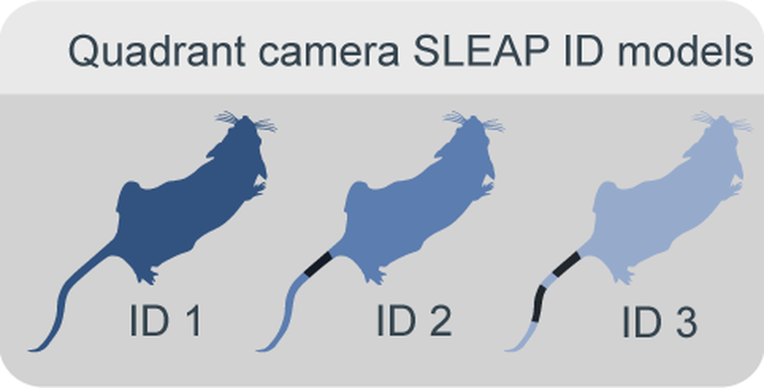
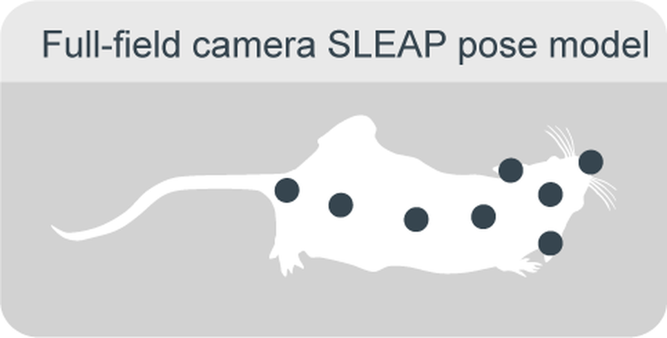

(target-multianimal-tracking)=
# Multi-Animal Tracking

:::{figure} ../images/ma-main.png
:height: 300px
:alt: multi-animal-tracking

Online tracking of location, poses and identity of individual animals allows for quantification of natural behaviours.
:::
By quantifying position and locomotion speed as well as estimating the poses of multiple animals over weeks, we can identify the emergence of spontaneous behaviours such as foraging, as well as investigate social dynamics and individual strategies and their modulation by environmental influences. This is possible through the multipronged approach using the computer vision software [SLEAP](sleap:) on multiple cameras as well as RFID sensors embedded in a single workflow.

## Identity Model
::::{grid} 2
:margin: 0

:::{grid-item}
:columns: 4
:child-align: center

:::
:::{grid-item}
:columns: 8
:child-align: center

To enable reliable individual identification, distinctive band patterns are tattooed on the mice's tails as clear and stable markers. Four overhead quadrant cameras capture high-resolution, zoomed-in images of the arena, allowing the experiment-specific SLEAP identity model to track each mouse by recognizing these unique tail patterns. These identity models are trained for each unique set of subjects.

*Relevant repositories: [aeon_sleap_processing](aeon-sleap-processing-github:)*
:::
::::

## Pose Model
::::{grid} 2
:margin: 0

:::{grid-item}
:columns: 4
:child-align: center

:::
:::{grid-item}
:columns: 8
:child-align: center

The SLEAP pose model tracks eight body parts along each mouse using an overhead camera with a view of the entire habitat and was designed to be reusable across experiments with similar arena setups.

*Relevant repositories: [aeon_sleap_processing](aeon-sleap-processing-github:)*
:::
::::

## Inference Pipeline
:::{figure} ../images/ma-inference-pipeline.png
:height: 300px
:alt: multi-animal-tracking
:::
The SLEAP identity model runs on all quadrant views, assigning an identity and a likelihood score for each detected mouse. For each mouse, the prediction with the highest likelihood is selected. These selected identities are then projected back onto the full-field camera view, where SLEAP’s pose-inference model estimates multi-point skeletons for each mouse. The final output combines both pose and identity assignments.

*Relevant repositories: [aeon_sleap_processing](aeon-sleap-processing-github:)*

## RFID Validation
Animals are implanted with RFID tags that allow us to quantify their visits to important sites which are equipped with RFID antennae (nest, foraging patches, gates). These RFID detections provide ground truth data for validating identity tracking accuracy.

*Relevant repositories: [aeon_sleap_processing](aeon-sleap-processing-github:)*
