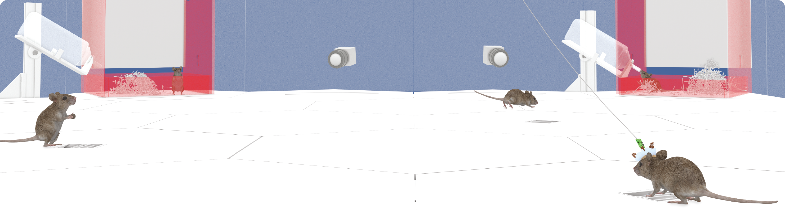
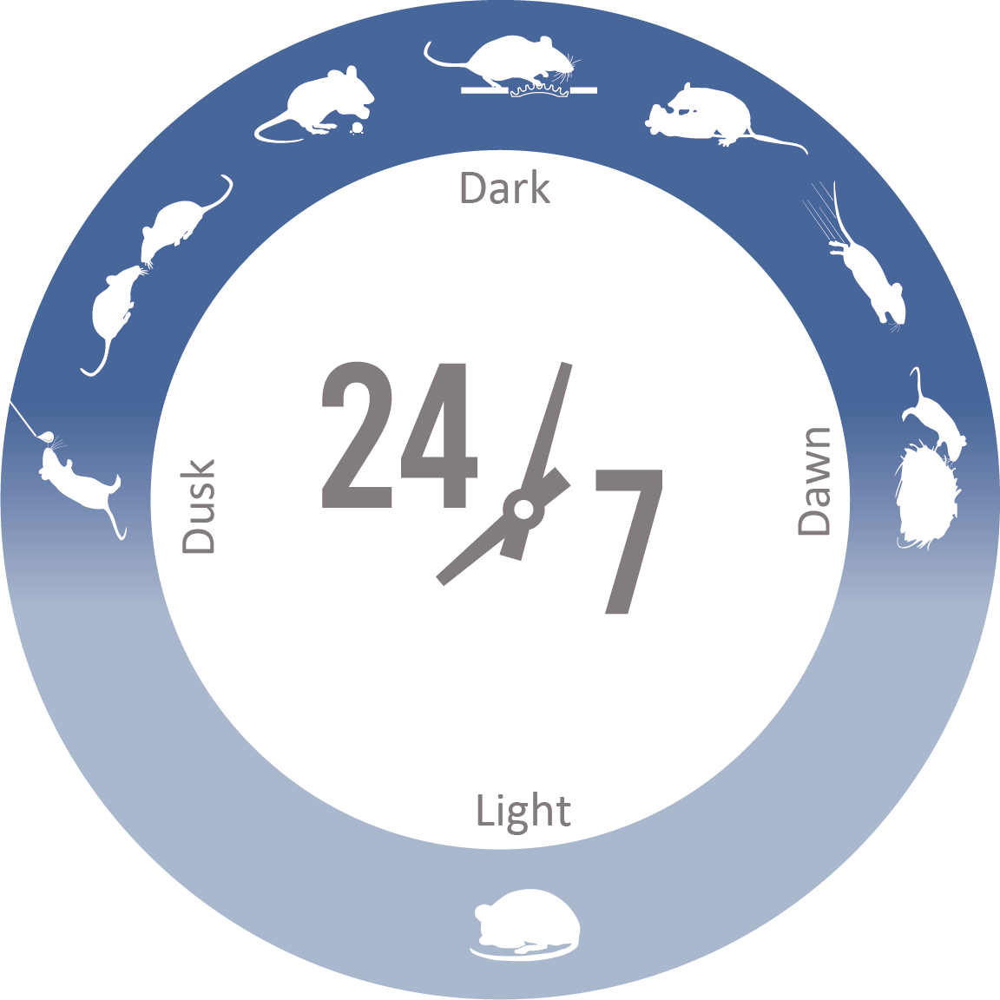
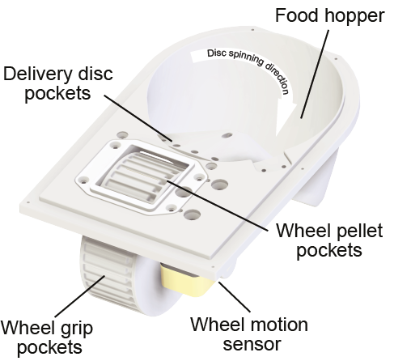
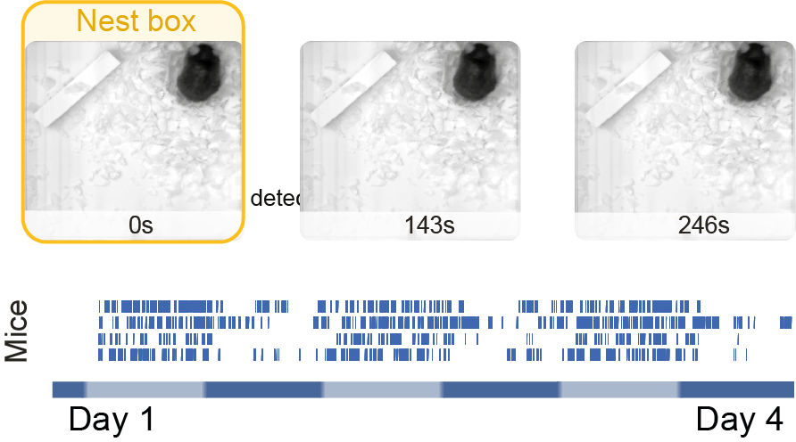
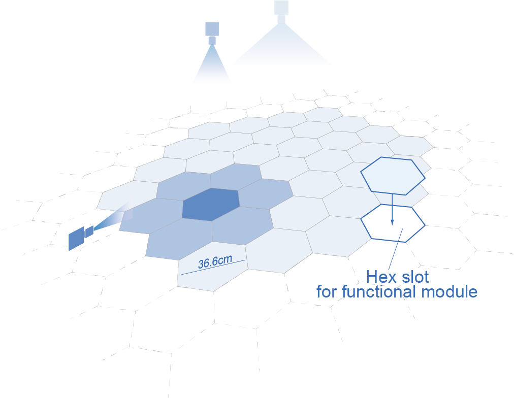

(target-home)=

{align=center}
# Aeon

An open-source platform to study the neural basis of ethological behaviours over naturalistic timescales.
<!-- This project is contributed to by researchers and support staff at UCL's SWC, Neurogears, and Datajoint. For a full list of contributors, please see the [Contributors](target-project-contributors) section. -->

::::{grid} 2
:gutter: 2

:::{grid-item}
:columns: 4
:child-align: center
{align=left}
:::
:::{grid-item}
:columns: 8
:child-align: center
:padding: 0 0 5 0
<p class="h4">Learn more about Aeon</p>

Discover how Aeon allows us to record and quantify different natural behaviours, 
such as foraging, nesting, escape and social interaction, and their neural basis, 
continuously over multiple weeks.

```{button-ref} getting_started/index
:color: primary
To the Introduction
```
:::

:::{grid-item}
:columns: 8
:child-align: center
:padding: 0 0 0 5
<p class="h4">Browse Aeon functional modules</p>

Gain insights into the software and hardware components that make up Aeon.

```{button-ref} reference/index
:color: primary
To the Reference Guide
```
:::
:::{grid-item}
:columns: 4
:child-align: center
{align=right}
:::

:::{grid-item}
:columns: 4
:child-align: center
{align=left}
:::
:::{grid-item}
:columns: 8
:child-align: center
:padding: 0 0 5 0
<p class="h4">Explore the sample data</p>

Learn more about how Aeon data is acquired, stored and processed through the sample data and example analysis notebooks.

```{button-ref} user/index
:color: primary
To the User Guide
```
:::

:::{grid-item}
:columns: 8
:child-align: center
:padding: 0 0 0 5
<p class="h4">Contribute to Aeon</p>

Want to contribute to Aeon? The contributing guidelines are a good place to start.

```{button-ref} contributor/index
:color: primary
To the Contributor Guide
```
:::
:::{grid-item}
:columns: 4
:child-align: center
{align=right}
:::
::::

## Citation Policy

If you use Project Aeon in your research, please cite it as below:

Sainsbury Wellcome Centre Foraging Behaviour Working Group. (2023). Aeon: An open-source platform to study the neural basis of ethological behaviours over naturalistic timescales,  https://doi.org/10.5281/zenodo.8411157

[](https://zenodo.org/doi/10.5281/zenodo.8411157)

:::{toctree}
:maxdepth: 2
:hidden:

getting_started/index
user/index
contributor/index
reference/index
about/index