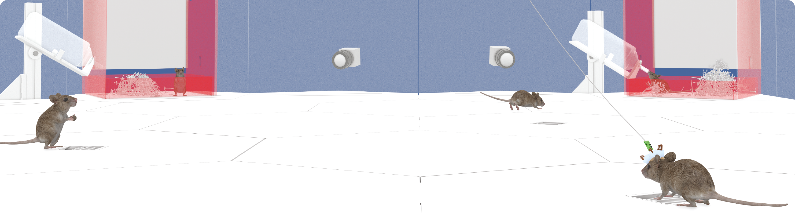
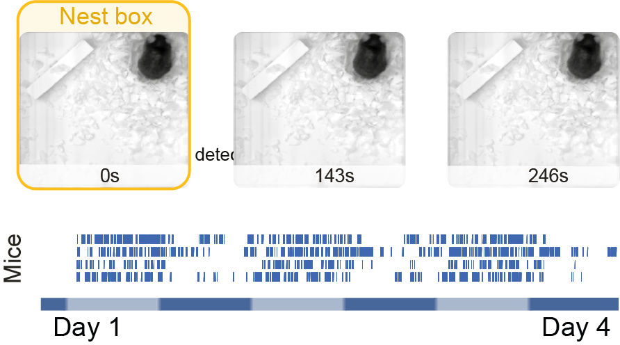
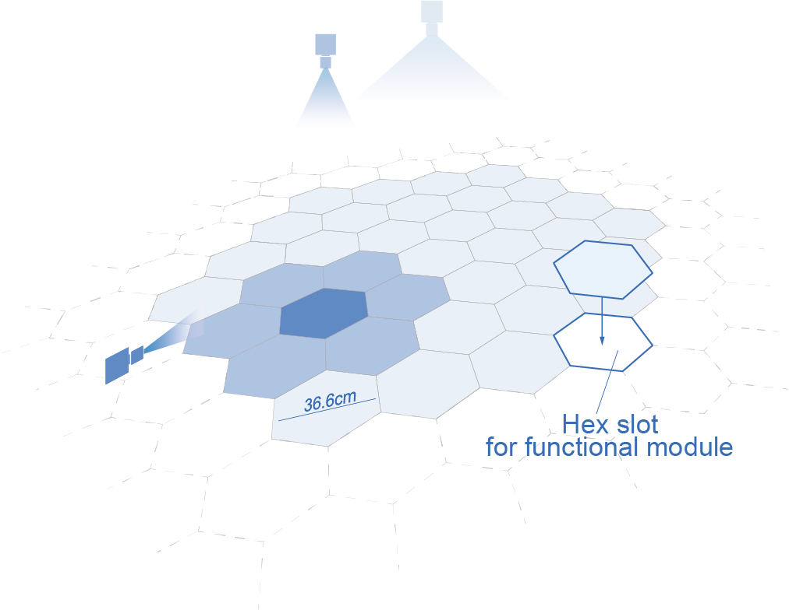

(target-home)=

{align=center}
# Aeon

An open-source platform to study the neural basis of ethological behaviours over naturalistic timescales.

::::{grid} 2
:gutter: 2

:::{grid-item}
:columns: 4
:child-align: center
{align=left}
:::
:::{grid-item}
:columns: 8
:child-align: center
:padding: 0 0 5 0
<p class="h4">Learn more about Aeon</p>

Discover how Aeon allows us to record and quantify different natural behaviours, 
such as foraging, nesting, escape and social interaction, and their neural basis, 
continuously over multiple weeks.

```{button-ref} getting_started/index
:color: primary
Get started
```
:::

:::{grid-item}
:columns: 8
:child-align: center
:padding: 0 0 0 5
<p class="h4">Browse Aeon functional modules</p>

Gain insights into the software and hardware components that make up Aeon.

```{button-ref} user/aeon_modules
:color: primary
To Aeon Modules
```
:::
:::{grid-item}
:columns: 4
:child-align: center
{align=right} 
:::

:::{grid-item}
:columns: 4
:child-align: center
{align=left}
:::
:::{grid-item}
:columns: 8
:child-align: center
:padding: 0 0 5 0
<p class="h4">Explore the sample data</p>

Learn more about how Aeon data is acquired, stored and processed through the sample data and example analysis notebooks.

```{button-ref} user/index
:color: primary
Learn by example
```
:::

:::{grid-item}
:columns: 8
:child-align: center
:padding: 0 0 0 5
<p class="h4">Contribute to Aeon</p>

Want to contribute to Aeon? The contributing guidelines are a good place to start.

```{button-ref} contributor/index
:color: primary
Read our contributor's guide
```
:::
:::{grid-item}
:columns: 4
:child-align: center
{align=right}
:::
::::

## Citation Policy

If you use Aeon in your research, please cite it as below:

Aeon: an open-source platform to study the neural basis of ethological behaviours over naturalistic timescales  
D. Campagner, J. Bhagat, G. Lopes, L. Calcaterra, A. G. Pouget, A. Almeida, T. T. Nguyen, C. H. Lo, T. Ryan, B. Cruz, F. J. Carvalho, Z. Li, A. Erskine, J. Rapela, O. Folsz, M. Marin, J. Ahn, S. Nierwetberg, S. C. Lenzi, J. D. S. Reggiani, SGEN group – SWC GCNU Experimental Neuroethology Group
bioRxiv 2025.07.31.664513; doi: https://doi.org/10.1101/2025.07.31.664513

[](https://doi.org/10.1101/2025.07.31.664513)

:::{toctree}
:maxdepth: 2
:hidden:

getting_started/index
user/index
contributor/index
reference/index
about/index