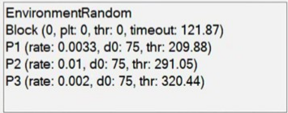

The `LabelControl (Aeon.Environment)` node builds a text box visualiser and populates it with the string representation of its input sequence. This can be used to display various experimental parameters and states in a custom visualiser and control panel. 

In Aeon it is used to report the current environmental and experimental parameters.

Specifically, this generates a visualiser that provides online window reporting: 

1. The name of the chosen environment YAML file that defines the experimental logc and parameters. 

2. Information about the current experimental block; the block number, number of delivered pellets, threshold and timeout parameters.

3. Information about all foraging patches in the arena; the current depletion rate, delta and current threshold.