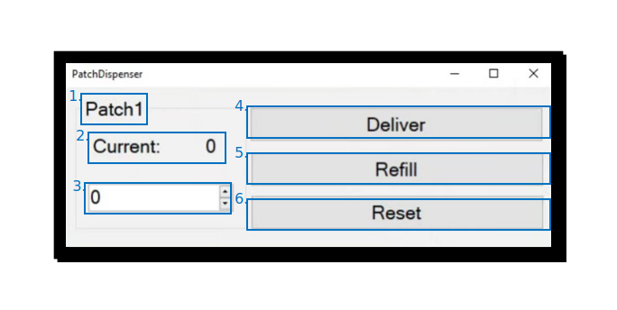

The [`PatchDispenser`](../../foraging_patch/auxiliary_nodes/patch_dispenser.md) node tracks pellet counts and deliveries, but also constructs a visualiser and control panel to control a specific patch. Each element of this control panel and its function is described here:

1. The name given to this patch.
2. The current estimated number of pellets in the feeder.
3. Dialog box to enter a new number of pellets, most often used for refilling the feeder.
4. Button to activate a manual delivery of a pellet, regardless of activity of the wheel.
5. Button to activate the refill function of the feeder. The number of available pellets will update with the number entered into dialog box 3.
6. Button to reset the feeder, following a refill or in case the feeder or associated hardware has entered an erroneous state.
