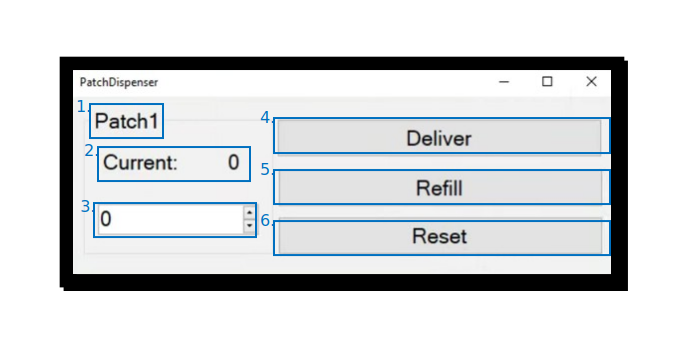

(target-module-foraging-patch)=
# Foraging Patch

The foraging patch module is core to foraging and long-term 24/7 experiments. 
It is utilised with a [foraging patch](target-foraging-patch) hardware module assembly to provide a means for animals in the [habitat](target-habitat) to obtain food by turning a configurable wheel, simulating a naturalistic digging action. 

The primary [`UndergroundFeeder (Aeon.Foraging)`](target-node-undergroundfeeder) node handles the connection to the foraging patch hardware through a [Harp output expander](harp-tech:api/Harp.OutputExpander) and defines the basic functions of the foraging patch.

## Nodes
To extend the functionality of the foraging patch, the following auxiliary nodes are provided:
- [`PatchDispenser (Aeon.Foraging)`](target-node-patchdispenser)
- [`PelletMonitor (Aeon.Foraging)`](target-node-pelletmonitor)
- [`TimeSpentOnWheel (Aeon.Foraging)`](target-node-timespentonwheel)
- [`TimeSinceLastEvent (Aeon.Foraging)`](target-node-timesincelastevent)

These nodes process events from the [`UndergroundFeeder`](target-node-undergroundfeeder) node and retrieve or compute informative metrics for visualisation, logging, and task control. 
Each of these auxiliary nodes accept events carried by shared `Subject`s from the `UndergroundFeeder` node. 
Together, these create a comprehensive foraging assembly known as a "Patch" that allows for real-time tracking of multiple measures extracted from processing sensor data and events from the foraging patch device. 
These are passed to shared `Subject`s:

- PelletCount
- TimeSpentOnPatches
- TimeSinceLastVisit
- TotalDistanceTravelled
- MissedPellets
- ManualPellets
- TotalPelletsDelivered

These `Subject`s can then be utilised for processing, task logic, logging and visualisation of the experimental procedure. 

The [`PatchDispenser`](target-node-patchdispenser) and [`PelletMonitor`](target-node-pelletmonitor) nodes work together to monitor delivery commands and beam break events to keep track of the number of pellets available to be delivered and the reason each pellet was delivered (a retry, automatic or manual delivery). 
It also monitors the current configuration of the patch assembly, including the threshold and current position of the foraging wheel, to facilitate recovery from unexpected interruptions or workflow crashes.
The [`TimeSpentOnWheel`](target-node-timespentonwheel) and [`TimeSinceLastEvent`](target-node-timesincelastevent) nodes are used to compute these relevant measures for logging, visualisation and experiment monitoring.

(target-node-undergroundfeeder)=
### UndergroundFeeder
The `UndergroundFeeder (Aeon.Foraging)` node establishes a connection to the [foraging patch](target-foraging-patch) hardware module assembly through a [Harp output expander](harp-tech:api/Harp.OutputExpander). 
It also defines the basic functions of the foraging patch and a workflow to configure the device operation properties. 
The device uses the standardised Harp communication protocol, producing timestamped Harp messages when device events occur.

#### Inputs
None

#### Outputs
Stream of all `Harp.HarpMessages` emitted by the Harp device.

#### Properties
##### General
These properties are critical parameters for the operation of the device.

| Property name | Description                                               |
|---------------|-----------------------------------------------------------|
| **PortName**  | The COM port the output expander attached to your foraging patch is connected to |
| **Radius**    | The radius of the foraging wheel in centimeters. This is used to compute the distance the wheel has been turned. The Aeon [foraging patch](target-foraging-patch) wheel has a radius of 4cm |
| **SampleRate**| The sampling rate of the magnetic encoder monitoring the wheel, selected from options available. For Aeon experiments, this is set to 500Hz |

##### Retry function
If a pellet is due to be delivered, an IR beam break module in the foraging patch detects whether the pellet delivery is successful. 
In the event that a pellet is not delivered (no beam break detected), then the foraging patch can be configured to try again. 
These properties configure the options around this functionality.

| Property name | Description                                   |
|---------------|-----------------------------------------------|
| **DueTime**   | The time following a pellet delivery command that the device will wait for a successful beam break signal before assuming the pellet delivery has failed |
| **Count**     | The number of retry attempts the foraging patch will perform |

##### Subjects
Events (outputs) from and commands (inputs) to the `UndergroundFeeder` node are published to shared `Subject`s, the names of which are configured in the properties of the node. 
The output `Subject`s are then accessible in the Bonsai editor's toolbox and are useable elsewhere in the workflow using the same names.

###### Device event subjects
| Subject name      | Type        | Description                   |
|-------------------|-------------|-------------------------------|
| **PatchEvents**      | `Harp.HarpMessage`       | Contains all events, consisting of timestamped Harp messages reporting the state of each register of the output expander. Also output directly by the `UndergroundFeeder` node |
| **WheelDisplacement**| `Harp.Timestamped<double>`| The sample-to-sample displacement of the foraging wheel in mm           |
| **PelletDelivered**  | `Harp.Timestamped<bool>`  | Reports `True` when a pellet is detected by the IR beam break register |

###### Device command subjects
| Subject name      | Type          | Description                                                                                     |
|-------------------|---------------|-------------------------------------------------------------------------------------------------|
| **DeliverPellet**    | `object`   | Trigger pellet delivery. Any event passed to this `Subject` will trigger a pellet delivery      |
| **ResetFeeder**      | `object`   | Trigger foraging patch reset. Any event passed to this `Subject` will trigger a foraging patch reset |

#### Usage
Create a `GroupWorkflow` and give it an appropriate name, e.g. "Patch1". 
Inside, place an `UndergroundFeeder (Aeon.Foraging)` node, externalise all properties, and connect it to the `WorkflowOutput`:

:::workflow

:::

### Additional nodes / subjects to be considered
- [ ] `RepeatEveryBlock`
- [ ] `PatchDistanceState`
- [ ] `PatchState`
- [ ] `PatchDeliveryCount`
- [ ] `PatchTimeSpent`
- [ ] `PatchTimeSinceLastVisit`
- [ ] `PatchWheelDisplacement`

## GUI
The foraging patch hardware has several commands that may be initiated by the user, actuated through clickable buttons in a customisable control panel built by the [PatchDispenser](target-node-patchdispenser) node.
  
### Environment metadata

(target-node-patchdispenser-control-panel)=
### PatchDispenser control panel
In addition to the monitoring of pellet counts and the current state of the foraging patch, the [`PatchDispenser`](target-node-patchdispenser) node also comes with its own GUI interface for controlling the foraging patch hardware during an experiment.

1. **Patch name**: The name assigned to this patch, e.g. "Patch1".
2. **Current pellet count**: The current estimated number of pellets in the foraging patch hopper.
3. **Pellet count entry**: Dialog box to enter a new pellet count, e.g. during a manual refill of the foraging patch.
4. **Deliver**: Button to trigger a manual pellet delivery, regardless of the activity of the wheel.
5. **Refill**: Button to update the current pellet count with the count specified in the pellet count entry dialog box. Typically used during maintenance mode.
6. **Reset**: Button to reinitialise the foraging patch, typically after human intervention, e.g. following a refill or in case the foraging patch or associated hardware has entered an erroneous state.

### Patch threshold and wheel monitoring

## Logging
Outputs from the feeder nodes are first formatted using the `Format` node, within which the register addresses are configured for software generated data logs.
Utilising available registers of the output expander, the formatted outputs are then combined to form a "Patch" assembly, before being passed to the[`LogHarpState (Aeon.Acquisition)`](target-node-logharpstate) node to be written to a log file.

:::workflow

:::

:::{note}
Register address 203 is not shown in this workflow, but is generated as events marked as a retry following an unsuccessful delivery attempt. 
This is passed to the "PatchEvents" `Subject` within the [`UndergroundFeeder`](target-node-undergroundfeeder) node.
:::

**Data schema**

| Register name         | Access | Address | Type    | Mask type          | Description                                   |
|-----------------------|--------|---------|---------|--------------------|-----------------------------------------------|
| **TimestampSeconds**          | Event  | 8       | U32    | -                             | Heartbeat                                       |
| **AuxInState**                | Event  | 32      | U8     | AuxiliaryInputs               | State of beam break                             |
| **OutputSet**                 | Write  | 35      | U8     | DigitalOutputs                | Deliver pellet command                          |
| **OutputClear**               | Write  | 36      | U8     | DigitalOutputs                | Deliver pellet command has been cleared         |
| **ExpansionBoard**            | Event  | 87      | U8     | ExpansionBoardType            | Should always be 1 (MagneticEncoder)            |
| **MagneticEncoder**           | Event  | 90      | U16    | [Angle, Magnitude]            | Reported angle and magnitude of magnetic encoder|
| **MagneticEncoderSampleRate** | Event  | 91      | U8     | MagneticEncoderSampleRateMode | Should always be 4 (500Hz)                      |
| **(dispenser_state)**        | -      | 200     | F32    | -                             | The current state of the pellet dispenser       |
| **(delivery_manual)**         | -      | 201     | U8     | -                             | Manual pellet delivery events log               |
| **(missed_pellet)**           | -      | 202     | U8     | -                             | Missed pellet events log                        |
| **(delivery_retry)**          | -      | 203     | U8     | -                             | Missed pellet events log                        |

## State persistence
To ensure robustness and enable recovery from system crashes or other errors in long-term experiments, the state of the experiment can be stored in a `StateRecoverySubject` that persists over multiple executions of the same workflow.

Two of these subjects are initially declared per patch, at the highest level of the workflow. 
For instance, `Patch1State` stores the state of the patch itself, including the current wheel displacement and the foraging threshold of the associated dispenser module, `Patch1Dispenser`.

The state of a patch includes: 
- The distance the wheel has been turned, 
- the current threshold set for pellest delivery, 
- the total number of pellets delivered, and 
- the number of pellets still present in the foraging patch.

## Alerts
<!-- To be completed -->

:::{toctree}
:maxdepth: 1
:hidden:
:glob:

foraging_patch/*