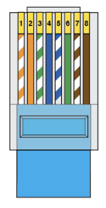
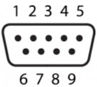

# Linear commutator wiring schematic

The position of the [linear commutator](./linear_commutator.md) is updated in real time, using tracking information from the Bonsai workflow to maintain a constant slack level on a cable connected to a mounted headstage on a freely moving animal. In AEON, this is currently bridged from the behaviour machine by a bespoke <!-- TODO:  Fix link-->[controller device](./link/to/controllerDevice_ifExists.md) that implements the [harp](https://harp-tech.org) protocol in μPython ([μHarp](https://github.com/SainsburyWellcomeCentre/microharp)). 

## Connections
1. Power is provided from 24V lines from the PSU connected to the power terminals of the motor via a screwgate connection. 

2. The μHarp controller receives a common clock signal through a 3.5mm mini-jack connection from one of the 'Clock out' ports on the[timestamp_generator](./timestamp_generator.md).

3. Finally, the μHarp controller is connected to the behaviour machine with a USB connection, which is used to both power the device and pass messages from the Bonsai workflow to the commutator motor driver.

4. The μHarp controller is connected to the motor driver by an RJ45 cable terminating in a RS232 serial port, connecting to the pins by soldering or otherwise, in the following configuration:

## RJ45 (T568B) pinout

## Serial pin numbers

N.B. viewed from the **back** of the connector, not the face that connects to the driver socket

## RJ45 - DB9 serial connections
| RJ45 line number | RJ45 line color     | Serial pin |
|------------------|---------------------|------------|
|        1         | White/Orange        |     NC     |
|        2         | Orange              |     NC     |
|        3         | White/Green         |     NC     |
|        4         | Blue                |      5     |
|        5         | White/Blue          |      9     |
|        6         | Green               |     NC     |
|        7         | White/Brown         |     NC     |
|        8         | Brown               |      3     |