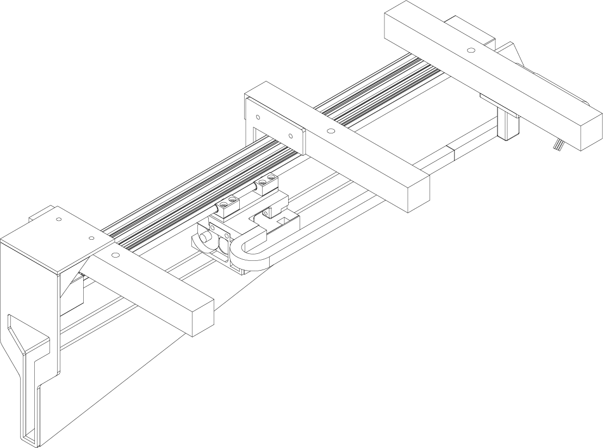

:::{note}
This section is still under construction. Some information may be incomplete or unavailable at this time.
:::

(target-hardware)=
# Hardware Overview
## Main modules
| Module | Files |
| --- | --- |
| **Arena**  {height=15em align=center} | <ul><li>[Assembly guide](../_static/resources/Arena%20guideline%20Final%201.pdf)</li><li>[Bill of materials](../_static/resources/Arena%20BOM.xlsx)</li></ul> |
| **Feeder**  {height=12em align=center} | <ul><li>[Assembly guide](../_static/resources/Feeder%20Guideline%20Final%201.pdf)</li><li>[Bill of materials](../_static/resources/Feeder%20BOM.xlsx)</li></ul> |
| **Nest**  {height=15em align=center} | <ul><li>[Assembly guide](../_static/resources/Nest%20Guideline%20Final%201.pdf)</li></ul> |
| **Closed-loop translation-commutation system**  {height=15em align=center} | <ul><li>[Assembly guide](../_static/resources/Linear%20commutator%20Guideline%20Final%201.pdf)</li></ul> |

## Harp devices
| Harp Device                       | Associated Component            | Description                                                   | Quantity | 
|-----------------------------------|---------------------------------|---------------------------------------------------------------|----------|
| [**Harp Output Expander**](harp-tech:api/Harp.OutputExpander.html)                  |  Foraging Patches (Feeders)      | Expander module to connect feeder to harp system. 1 per patch | 4        |
| [**Harp CameraController Gen2**](harp-tech:api/Harp.CameraControllerGen2.html)    | Cameras                         | Controller to trigger all cameras in the arena                | 1        |
| [**Harp Timestamp Generator Gen3**](harp-tech:api/Harp.TimestampGeneratorGen3.html) | Arena (Synchronizes all devices)| Synchronizes all harp devices in the arena                    | 1        |
| [**Micropython Harp device**](https://github.com/SainsburyWellcomeCentre/microharp)       | Ephys linear rail drive         | Linear rail position controller and position sensor reciever  | 1        | 
| [**Harp SoundCard**](harp-tech:api/Harp.SoundCard.html)                  | SP speaker                      | Control and monitoring of audio speaker                     | 1        | 

## Wiring diagrams
- [Wiring diagram](../_static/resources/Example%20wiring%20diagram.pdf)

<!--
:::{toctree}
:maxdepth: 1
:hidden:
hardware/feeder

::::{grid} 1 3 3 3 
:::{grid-item-card} Feeder
:img-top: ../_static/images/hardware-overview-feeder.png
:link: target-feeder
:link-type: ref
:img-bottom: ../_static/images/hardware-overview-feeder.png
:::

:::{grid-item-card} Arena
:img-bottom: ../_static/images/hardware-overview-arena.png
:::

:::{grid-item-card} Nest
:img-bottom: ../_static/images/hardware-overview-nest.png
:::
::::
-->