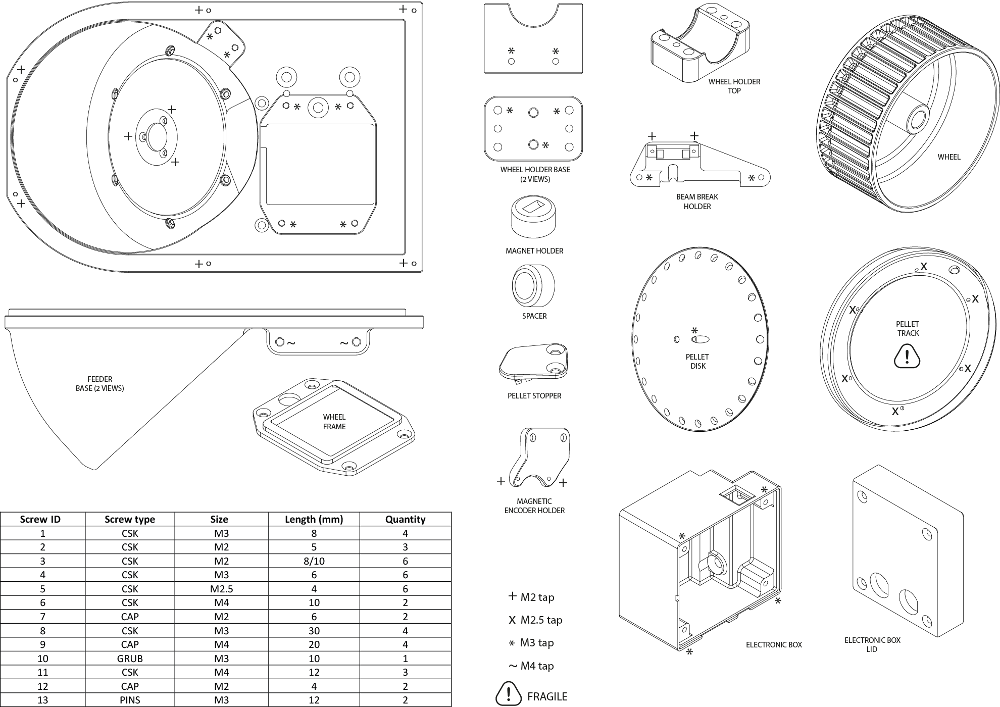

(target-feeder)=
# Feeder

Insert description of the feeder.

## Parts List

## Assembly Instructions

1.	Trim slightly the motor metal pin using a grinding wheel or a handheld dremel. Trim until you create a flat surface on the pin. 

2.	Rotate the feeder base and insert the motor. Screw the motor in place from the front using three screws (ID 2)

3.	 Carefully handle the track and gently insert it in the feeder making sure of aligning the holes. Rotate the feeder base and hold the track in place by using six screws (ID 5)

4.	Lower the disk into the feeder base making sure to orient the grub screw tapped hole toward the flat surface previously created on the motor metal pin (see step 1). Push down the disk until the top of the pin is flushed to the disk itself and use a grub screw (ID 10) to hold the disk in place. Make sure the grub screw touches the flat surface of the trimmed motor pin.

5.	Insert two short silicon tubes in each pellet stopper pin and screw it in place with two screws (ID 4). 

6.	Place the wheel frame on the feeder base with 4 screws (ID 4)

7.	Carefully insert the beam break PCB board into the beam break holder (ID 12).

8.	Slot the beam break holder in the back of the feeder base and screw it in place from the front (ID 1).

9.	Hold the wheel holder base on the back of the feeder base and screw it in place with 3 screws (ID 11, see colours).

10.	Insert two parallel pin (ID 13) in the middle holes. If needed, enlarge the holes using a sharp reamer.

11.	Holding the shoulder bolt, insert the magnet holder on the cap and put the neodymium magnet into place (the magnet would hold its position). Slide the one way bearing, the spacer and the two ways bearing onto the bolt.

12.	Insert the shoulder bolt into the wheel hole and tighten it in place using a lock nut. If needed, enlarge the hole using a sharp reamer.

13.	Rotate the feeder on its back and place the shoulder bolt with the bearings onto the wheel holder base. The wheel should sit withing the feeder base opening (blue).

14.	Lower the wheel holder top onto the bearing and insert the pins. Carefully align the holder base and top using the pins as well as 4 screws (ID 9). The aim is to obtain an equally spaced gap between the wheel holder base and the top.

15.	Screw the magnetic encoder holder into place (ID 1).

16.	Screw the electronic box on the side of the feeder base (ID 6) and insert the feeder electronics. The screws need to be inserted from the inside of the box itself.

17.	Add the Raspberry Pi Pico to the feeder electronics.

18.	Close the box with the electronic box lid (ID 8).

19.	Gently place the magnetic encoder onto its holder (ID 7). The magnet should face the magnetic encoder chip.

20.	Attach the assembled feeder to the metal hexagon tile using 6 screws (ID 3). 

21.	To complete the feeder, add the feeder tile orienting the tile engraving with the feeder. Metal tile and feeder tile should be flushed and only the wheel exposed. 
