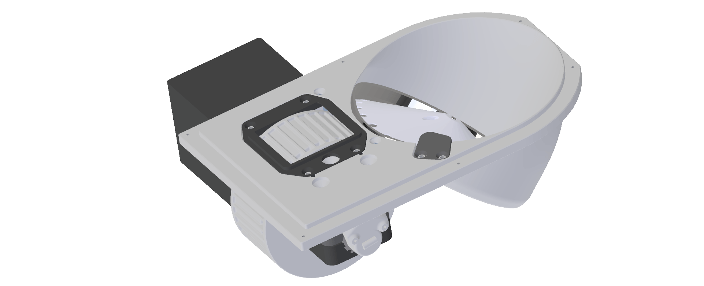

(target-feeder-carousel-in-tab)=
# Feeder4

Insert description of the feeder.

## Parts List

## Assembly Guide
::::::{tab-set}
:::::{tab-item} Pellet Hopper
::::{carousel}
:data-bs-interval: "false"

:::{figure} ../../_static/images/feeder-pellet-hopper1.png
%
1\. Trim slightly the motor metal pin using a grinding wheel or a handheld Dremel. Trim until you create a flat surface on the pin. 
:::

:::{figure} ../../_static/images/feeder-pellet-hopper2.png
%
2\. Rotate the feeder base and insert the motor. Screw the motor in place from the front using three screws (ID 2).
:::

:::{figure} ../../_static/images/feeder.png
%
3\. Carefully handle the track and gently insert it in the feeder making sure of aligning the holes. Rotate the feeder base and hold the track in place by using six screws (ID 5).
:::

:::{figure} ../../_static/images/feeder.png
%
4\. Lower the disk into the feeder base making sure to orient the grub screw tapped hole toward the flat surface previously created on the motor metal pin (see step 1). Push down the disk until the top of the pin is flushed to the disk itself and use a grub screw (ID 10) to hold the disk in place. Make sure the grub screw touches the flat surface of the trimmed motor pin.
:::

:::{figure} ../../_static/images/feeder.png
%
5\. Insert two short silicon tubes in each pellet stopper pin and screw it in place with two screws (ID 4). 
:::
::::
:::::

:::::{tab-item} IR Sensor
::::{carousel}
:data-bs-interval: "false"

:::{figure} ../../_static/images/feeder-ir-sensor1.png
%
6\. Place the wheel frame on the feeder base with 4 screws (ID 4).
:::

:::{figure} ../../_static/images/feeder-ir-sensor2.png
%
7\. Carefully insert the beam break PCB board into the beam break holder (ID 12).
:::

:::{figure} ../../_static/images/feeder.png
%
8\. Slot the beam break holder in the back of the feeder base and screw it in place from the front (ID 1).
:::
::::

::::::