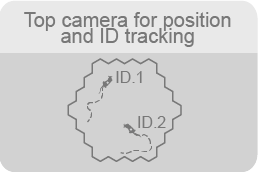
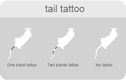
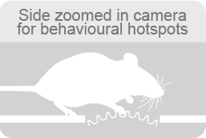

(target-multianimal-tracking)=
# Multi-animal tracking

:::{figure} ../../_static/images/ma-main.png
:height: 300px
:alt: multi-animal-tracking

Online tracking of location and identity of individual animals allows for quantification of natural behaviours.
:::
By quantifying both position as well as locomotion speed of multiple animals over weeks, we can identify the emergence of spontaneous behaviours such as foraging, as well as investigate social dynamics and individual strategies and their modulation by environmental influences.
This is possible through the multipronged approach using multiple cameras as well as RFID sensors embedded in a single workflow.

## Live position tracking
::::{grid} 2
:margin: 0

:::{grid-item}
:columns: 4
:child-align: center

:::
:::{grid-item}
:columns: 8
:child-align: center

An overhead camera with a view of the entire arena feeds into a Bonsai workflow and
continuously estimates the animals' x, y positions, body length, and orientation.

*Relevant repositories: [aeon_experiments](aeon-experiments-github:), [aeon_acquisition](aeon-acquisition-github:)*
:::
::::

## Identifying animals
::::{grid} 2
:margin: 0

:::{grid-item}
:columns: 4
:child-align: center

:::
:::{grid-item}
:columns: 8
:child-align: center

When there are multiple animals in the arena, identity of each animal can be
determined using computer vision ([SLEAP](https://sleap.ai/)) from the overhead camera using the individual tail tattoos (one
band, two bands, or none) as features. Furthermore, animals are implanted with RFID tags that
allow us to quantify their visits to important sites (nest, foraging patches, gates) which are equipped with RFID antennae. 

*Relevant repositories: [aeon_experiments](aeon-experiments-github:), [aeon_acquisition](aeon-acquisition-github:)*
:::
::::

## Pose estimation
::::{grid} 2
:margin: 0

:::{grid-item}
:columns: 4
:child-align: center

:::
:::{grid-item}
:columns: 8
:child-align: center

A zoomed-in view of the overhead camera together with side-view cameras at
behavioural hotspots such as the foraging patches allows for analysis of posture.

*Relevant repositories: [aeon_experiments](aeon-experiments-github:), [aeon_acquisition](aeon-acquisition-github:)*
:::
::::