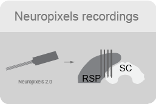

(target-npx-recording)=
# Neuropixels recordings

:::{figure} ../../_static/images/getting-started-npx.png
:height: 300px
:alt: neuropixels-recording

Week-long continuous neural recordings from a freely moving animal in a large environment.
:::

Conducting continuous neural recordings over multiple days in a large environment presents several technical challenges. 
It is crucial to ensure that the animal's movement is unrestricted and that the recording quality remains stable over time. To achieve this, it is essential to:

1. Maintain a constant slack in the recording tether, regardless of the mouse's location in the arena.
2. Prevent the tether from tangling when the mouse rotates.

To address these challenges, we developed a closed-loop control system capable of untwisting the cable using the [Onix torque-free commutator](https://open-ephys.org/commutator-info) and translating it based on the mouse's position.

## Closed-loop control of commutator location
{width=250px align=left}
Using the live position estimate from the overhead camera, we can control the horizontal position of the commutator on a linear rail to follow the animal as it moves through the arena. 

*Relevant repositories: [aeon_experiment](aeon-experiments-github:), [aeon_lineardrive](aeon-lineardrive-github:)*

## Closed-loop control of commutator rotation
{width=250px align=left}
Using the heading direction computed by the IMU sensor on the [Onix neuropixels headstage](https://open-ephys.github.io/onix-docs/Hardware%20Guide/Headstages/headstage-neuropix-2e-beta.html), the cable commutation is adapted in real time to avoid tangling.

*Relevant repositories: [aeon_experiment](aeon-experiments-github:), [bonsai-commutator](https://github.com/open-ephys/bonsai-commutator), [bonsai-onix1](https://github.com/open-ephys/onix-bonsai-onix1)*

## Neuropixels 2.0 recordings
{width=250px align=left}
All data are acquired using the [Onix recording system](https://open-ephys.github.io/onix-docs/index.html), which supports simultaneous recording with two [Neuropixels 2.0 probes](https://www.neuropixels.org/probe2-0). 

*Relevant repositories: [bonsai-onix1](https://github.com/open-ephys/onix-bonsai-onix1)*
